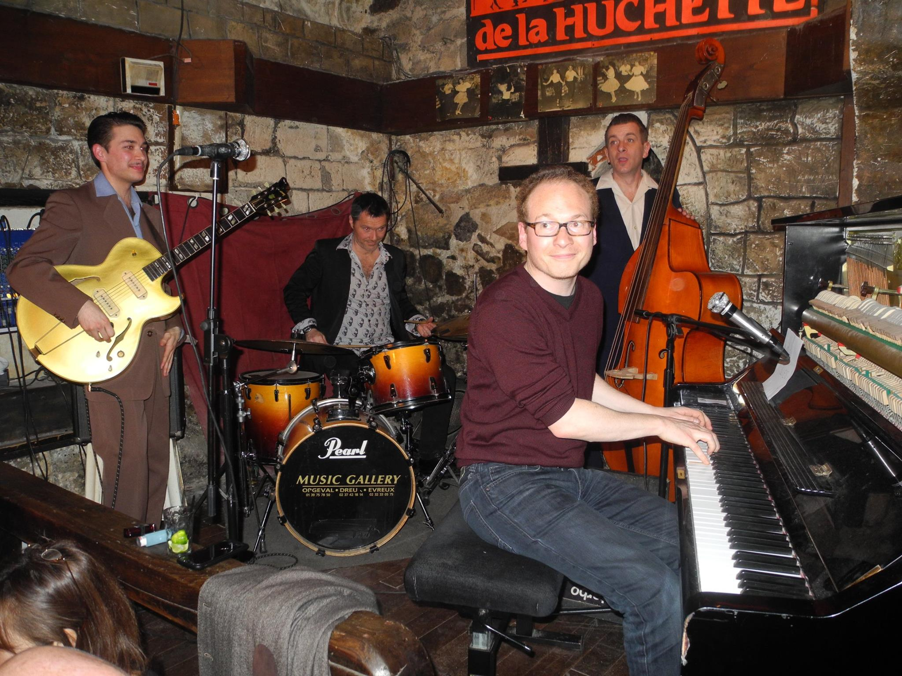

# Music Chords Charts

## in Elm


Christophe Benz – christophe.benz@jailbreak.paris

Note:
- Hello everyone, I'm Christophe Benz
- Happy and grateful to be here
- I'm gonna talk about music in the Elm language
- I'm a professionnal developer who loves Elm, adopted it 1 year ago, professionnally and personnally
- I work at Jailbreak, a free software development company, which adopted Elm in December for frontend development

---



Note:
- pianist who loves playing in Jam Sessions
- difficult to find a song everybody knows
- pianists or guitarists need a memo if don't remember everything in a song
- chords are harmony and tell us the color of the song at any point of time
- chords charts are a representation to tell musicians what notes to play and when, to synchronize them
- if you don't understand now what's a chord it's completely normal, I'll explain
- because I'm also a developer, I started the Open Chords Charts project: a free database of songs

---

# Music basic knowledge

+++

## What's a song?

- `song = melody + chords`
- applies to rock, blues, jazz, folk

Note:
- when I want to play a song, besides the melody, I need chords
- if I accompagny a singer, I need chords only

+++

## Not a music score


+++

## Already seen that?


Note:
- diagrams tell guitarists how to put their fingers on the fret

+++

## Example: Jazz song


Note:
- presented as a table
- different from a score
- key is the most important note of the song

+++

## Chords

- a note and a quality

- ## `C`
    means "C Major"
- ## `Fm`
    means "F minor"

+++

## Bars


- 1 bar = 4 beats
- 1 to 4 chords per bar


+++

## Complex example


Note:
- specific rendering for each chord quality
- extra metadata
- high ratio signal-noise

---

# `Music`

# package in Elm

+++

## Note type

```elm
type Note
    = A | Af | As -- f = "flat"
    | B | Bf | Bs -- s = "sharp"
    | C | Cf | Cs
    ...
    | F | Ff | Fs
    | G | Gf | Gs
```


Note:
- a note (A, B, C, etc.) can be either normal, flat or sharp

+++

## Chord type

```elm
type alias Chord =
    ( Note, Quality )

type Quality
    = Major
    | Minor
    | Augmented
    | MajorSixth
    | MinorSixth
    | Seventh
    ...
```

Note:
- qualities are just labels corresponding to commonly used chords

+++

## Chord value

### `Fm`

```elm
fMinor : Chord
fMinor = ( F, Minor )
```

+++

## Bar type


```elm
type Bar
    = Bar (List Chord)
    | BarRepeat
```

Note:
- I set a limit of 4 chords by bar

+++

## Bar value


```elm
bar1 : Bar
bar1 =
    Bar
        [ ( A, MinorSeventh )
        , ( D, Seventh )
        ]
```

+++

## Part type


```elm
type Part
    = Part String (List Bar)
    | PartRepeat String
```

+++

## Part value


```elm
partA : Part
partA =
    Part "A"
        [ Bar [ ( C, Major ) ]
        , BarRepeat
        , Bar [ ( E, Seventh ) ]
        , BarRepeat
        , Bar [ ( A, Seventh ) ]
        , BarRepeat
        , Bar [ ( D, Minor ) ]
        , BarRepeat
        ]
```

+++

## Chart type

### Top-level type

```elm
type alias Chart =
    { title : String
    , key : Note
    , parts : List Part
    }
```

+++

## View a Chart

The Elm Architecture

```elm
view : Chart -> Html msg
```


---

# Play it in `G`!


Note:
- a singer or a guitarist may ask to play in another key
- difficult to achieve while playing

+++

## Transpose


`$$transpose(C, 1) \to D$$`
`$$transpose(G, 1) \to A$$`

Note:
- transposition is a cyclical translation
- only 12 notes whereas we had 21 values
- the quality of a chord does not change
- so let's focus on transposing notes

+++

## Note indexes

```elm
toIndex : Note -> Int

toIndex C = 3
toIndex G = 10
```

```elm
fromIndex : Int -> Note

fromIndex 3 = C
fromIndex 10 = G
```

```elm
transposeNote : Int -> Note -> Note
transposeNote interval note =
    fromIndex ((toIndex note) + interval)
```

Note:
- note indexes are arbitrary

+++

## Nested pieces

- recompute chords
- chart → part → bar → chord → note

Note:
- transposing a chart is applying the interval to every pieces at each nesting level

+++

## Rewire bottom-up

```elm
transposeChord : Int -> Chord -> Chord
transposeChord interval ( note, quality ) =
    ( transposeNote interval note, quality )

transposeBar : Int -> Bar -> Bar
transposeBar interval bar =
    mapBarChords (transposeChord interval) bar

transposePart : Int -> Part -> Part
transposePart interval part =
    mapPartBars (transposeBar interval) part
```

+++

## Intervals

`$$interval(chartKey, newKey)$$`

```elm
interval : Note -> Note -> Int
interval note1 note2 =
    (toIndex note2 - toIndex note1) % 12
```

```elm
toIndex C = 3
toIndex G = 10

interval C G = 7
```

Note:
- there's still a missing info: how to compute the interval

+++

## Top-level

```elm
transpose : Note -> Chart -> Chart
transpose newKey chart =
    let
        interval =
            Note.interval chart.key newKey

        newParts =
            chart.parts
                |> List.map (transposePart interval)
    in
        { chart | key = newKey, parts = newParts }
```

Note:
- transposing a chords chart is basically transposing its parts, and setting the new key

+++

## Chart viewer / editor

# Demo

Note:
- show
    - transpose in G
    - click on edit
    - select a bar
    - change a chord
    - set a bar repeat
    - click on save
    - change the key

+++

## Chart viewer / editor


---

## A text format

```elm
allOfMe : Chart
allOfMe =
    let
        partA = Part "A"
            [ Bar [ ( C, Major ) ]
            , BarRepeat
            ...
            ]
        partB = ...
        partC = ...
    in
        { title = "All of me"
        , key = C
        , parts = [ partA, partB, PartRepeat "A", partC ]
        }
```

Note:
- building a chart in Elm is verbose so I implemented a human-friendly textual representation
- just an experiment
- like Markdown I like to have human-readable storage format
- people can share a chords charts in this format

+++

## A chord


## `C`

+++

## A repeated bar


## `–`

+++

## 2 chords in a bar


## `Am7/D7`

+++

## A part


<h2>
<pre>
= A
F - A6 - E7 - A/D7 Gm7/C7
</pre>
</h2>

+++

## The whole chart

```text
title: All of me
key: C

= A
C - E7 - A7 - Dm -

= B
E7 - Am - D7 - G7 -

= A

= C
F Fm C A7 Dø G7 C -
```

+++

## Chart to string

Using pattern matching

```elm
barToString : Bar -> String
barToString bar =
    case bar of
        Bar chords ->
            chords
                |> List.map Chord.toString
                |> String.join "/"

        BarRepeat ->
            "-"
```

Note:
- thanks to the type system I couldn't forget any case in my rendering

+++

## String to Chart

Using elm-tools/parser

```elm
chart : Parser Chart
chart =
    succeed Chart
        |. spacesAndNewlines
        |. symbol "title:"
        |. spaces
        |= keepUntilEndOfLine
        |. newLine
        |. symbol "key:"
        |. spaces
        |= note
        |. spacesAndNewlines
        |= repeat oneOrMore (part |. spacesAndNewlines)
        |. end
```

Note:
- type safe parsing
- almost same complexity than JSON decoders
- JSON encoders still needed for a web API in order to be easily consumable by other programming languages

---

# In short

- `Music` package in Elm
    - from real world examples
    - solving actual problems
    - data types then functions
- plain-text format
    - from real world examples

---

# Thank you!

- Elm is awesome to model a domain like music
- refactoring is a real pleasure
- https://open-chords-charts.github.io/chart-editor/

Note:
- TODO
    - web API
    - public Single-Page Application website with authentication
        - thanks to https://github.com/rtfeldman/elm-spa-example
    - offline mode
        - by downloading a snapshot of the chords charts in local storage?
        - using Progressive Web Apps?
