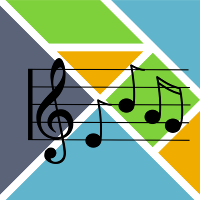

## Open Chords Charts



I'm Christophe Benz

developer and jazz pianist

christophe.benz@jailbreak.paris

---

Jam session!


Note:
- I'm also a pianist who loves Jazz and improvised music
- Happy and grateful to be here
- I will talk about music and Elm for 20 minutes

---

## Chords charts?

- `song = melody + chords + tonality`
- applies to rock, blues, jazz, folk
- transposing is changing tonality

Note:
- when I want to play a song, besides the melody, I need chords
  - rock, blues, jazz, folk – same principle!

+++

## Example: Jazz song


It's an image :-(

Note:
- it's a convenient way to represent a song
- keeping only chords
- presented as a table
- does not include the melody
- I'd like the transpose feature: change the tonality dynamically
- Can't to that with images or plain text

+++

## Already seen that?


We'll just keep the "letters"

+++

## Chords

<span style="font-size: 3em;">C</span>

Means "C Major"

<span style="font-size: 3em;">Fm</span>

Means "F minor"

+++

# Transposition

- recompute chords to change tonality of song
- difficult to achieve while playing

`$$transpose(C, 1) \to D$$`

---

## Music notes in Elm

```elm
type Note
    = A | Af | As -- f = "flat", s = "sharp"
    | B | Bf | Bs
    | C | Cf | Cs
    ...
    | F | Ff | Fs
    | G | Gf | Gs

type alias OctaveIndex = Int

toOctaveIndex : Note -> OctaveIndex

toOctaveIndex Es == toOctaveIndex Ff -- enharmonics
```

Note:
- first using Int but doesn't allow enharmonics
- then using ADT
- refactoring was secured by the Elm compiler

+++

## Chords in Elm

```elm
type alias Chord =
    ( Note, Quality )

type Quality
    = Major
    | Minor
    | Augmented
    | MajorSixth
    | MinorSixth
    | Seventh
    ...
```

```elm
fMinor : Chord
fMinor = ( F, Minor )
```

Note:
- qualities are just labels corresponding to commonly used chords

+++

## Chords Charts in Elm


+++

## Chords Charts in Elm

```elm
type alias Chart =
    { title : String
    , tonality : Note
    , parts : List Part
    }

type Part
    = Part String (List Bar)
    | PartRepeat String
```

+++

## Bars in Elm


```elm
type Bar
    = Bar (List Chord)
    | BarRepeat
```

Note:
- I set a limit of 4 chords by bar

+++

## Bars in Elm


```elm
bar1 : Bar
bar1 = Bar [ ( A, Minor ), ( D, Seventh ) ]
```

+++

## Transpose a chords chart

`$$interval(chart key, new key)$$`

Then apply the interval to the parts.

+++

## Transpose a chords chart

```elm
transpose : Note -> Chart -> Chart
transpose key chart =
    let
        interval =
            Note.interval chart.key key

        newParts =
            chart.parts |> List.map (transposePart interval)
    in
        { chart
            | key = key
            , parts = newParts
        }
```

Note:
- transposing a chords chart is basically transposing its parts, and setting the new key

+++

## Transpose a chords chart

note ∈ chord ∈ bar ∈ part ∈ chart

```elm
transposePart : Interval -> Part -> Part
transposePart interval part =
    part |> mapPartBars (List.map (transposeBar interval))

transposeBar : Interval -> Bar -> Bar
transposeBar interval bar =
    bar |> mapBarChords (List.map (Chord.transpose interval))

-- Music.Chord
transpose : Interval -> Chord -> Chord
transpose interval ( note, quality ) =
    ( Note.transpose interval note, quality )

-- Music.Note
transpose : Interval -> Note -> Note
transpose interval note =
    let
        octaveIndex =
            toOctaveIndex note
    in
        fromOctaveIndex (octaveIndex + interval)
```

@[1-3](Transose a part)
@[5-7](Transose a bar)
@[9-12](Transose a chord)
@[14-21](Transose a note)

---

## Chart viewer / editor


+++

```elm
allOfMe : Chart
allOfMe =
    let
        partA = Part "A"
            [ Bar [ ( C, Major ) ]
            , BarRepeat
            ...
            ]
        partB = ...
        partC = ...
    in
        { title = "All of me"
        , key = C
        , parts = [ partA, partB, PartRepeat "A", partC ]
        }
```

@[1-2]
@[3-10]
@[11-15]

+++

## Chart viewer / editor

```elm
type alias Model =
    { chart : Chart
    , viewedKey : Note
    }

view model =
    let
        viewedChart =
            model.chart
                |> Music.Chart.transpose model.viewedKey
    in
        ...
```

@[1-4]
@[6-12]

Note:
- viewed key is different from chart key

+++

## Chart viewer / editor


+++

## Chart viewer / editor

# Demo

Note:
- show
  - click on edit
  - select a bar
  - change a chord
  - set a bar repeat
  - click on save
  - change the key

---

## A text format


<span style="font-size: 3em;">`C`</span>

Note:
- started as an experiment
- human-friendly serialization
- people can share a chords chart by email in plain text

+++

## A text format


<span style="font-size: 3em;">`–`</span>

+++

## A text format


<span style="font-size: 3em;">`Dm/A7`</span>

+++

## A text format


<span style="font-size: 3em;">`Gm/Eb7/D7`</span>

+++

## A text format


<span style="font-size: 3em;">`Ab/C7/Fm/Eb6`</span>

+++

## A text format

```
title: All of me
key: C

= A
C - E7 - A7 - Dm -

= B
E7 - Am - D7 - G7 -

= A

= C
F Fm C A7 Dø G7 C -
```

@[1-2](Metadata)
@[4](Part name)
@[5](Chords of part A)
@[7-8](Part B)
@[10](Repeated part)

+++

### elm-tools/parser

```elm
chart : Parser Chart
chart =
    inContext "chart" <|
        succeed Chart
            |. spacesAndNewlines
            |. symbol "title:"
            |. spaces
            |= keepUntilEndOfLine
            |. newLine
            |. symbol "key:"
            |. spaces
            |= note
            |. spacesAndNewlines
            |= repeat oneOrMore (part |. spacesAndNewlines)
            |. end
```

Note:
- almost same complexity than JSON decoders
- JSON encoders still needed for a web API in order to be easily consumable by other programming languages

---

# Conclusion

- Elm is awesome to model a domain like music
- Refactoring is a real pleasure
- Work still in progress
- https://open-chords-charts.github.io/chart-editor/
- Questions?

Note:
- TODO
  - web API
  - public Single-Page Application website with authentication
    - thanks to https://github.com/rtfeldman/elm-spa-example
  - offline mode
    - by downloading a snapshot of the chords charts in local storage?
    - using Progressive Web Apps?
