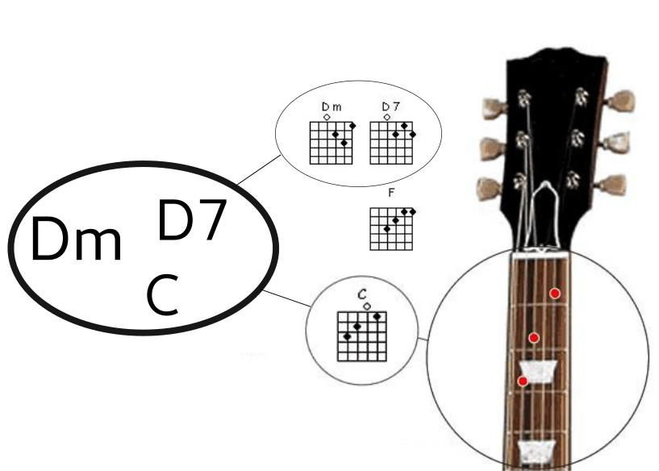
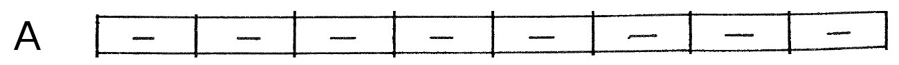

# Music Chords Charts

## in Elm


Christophe Benz – christophe.benz@jailbreak.paris

Note:
- Hello everyone, I'm Christophe Benz
- Happy and grateful to be here
- developer who loves Elm, adopted it 1 year ago, professionnally and personnally
- I'm gonna talk about music and Elm, especially about chords charts
- chords charts tell musicians what notes to play and when
- if you don't understand now what's a chord it's completely normal, I'll explain

---


Note:
- pianist who loves playing in Jam Sessions
- need a memo if don't remember everything in a song
- because I'm also a developer, I started the Open Chords Charts project: a free database of songs

---

## What's a song?

- `song = melody + chords`
- applies to rock, blues, jazz, folk

Note:
- when I want to play a song, besides the melody, I need chords
- if I accompagny a singer, I need chords only
- chords are the skeleton of the song
- chords tell us the color of the song at any point of time

+++

## Already seen that?



Just keep the *names*

Note:
- diagrams tell guitarists how to put their fingers on the fret

+++

## Example: Jazz song


Note:
- presented as a table
- different from a score
- key is the most important note of the song

+++

## Chords

<span style="font-size: 3em;">`C`</span>

Means "C Major"

<span style="font-size: 3em;">`Fm`</span>

Means "F minor"

+++

## Transposition

- recompute chords to change key of song

`$$transpose(C, 1) \to D$$`

`$$transpose(Fm, 1) \to Gm$$`

Note:
- the quality of a chord does not change
- let's focus on transposing notes

---

# `Music`

# package in Elm

+++

## `Note` type

```elm
type Note
    = A | Af | As -- f = "flat", s = "sharp"
    | B | Bf | Bs
    | C | Cf | Cs
    ...
    | F | Ff | Fs
    | G | Gf | Gs
```

TODO image flat and sharp

Note:
- a note (A, B, C, etc.) can be either normal, flat or sharp

+++

## `Chord` type

```elm
type alias Chord =
    ( Note, Quality )

type Quality
    = Major
    | Minor
    | Augmented
    | MajorSixth
    | MinorSixth
    | Seventh
    ...
```

Note:
- qualities are just labels corresponding to commonly used chords

+++

## `Chord` value

### `Fm`

```elm
fMinor : Chord
fMinor = ( F, Minor )
```

+++

## `Bar` type


```elm
type Bar
    = Bar (List Chord)
    | BarRepeat
```

Note:
- I set a limit of 4 chords by bar

+++

## `Bar` value


```elm
bar1 : Bar
bar1 =
    Bar
        [ ( A, MinorSeventh )
        , ( D, Seventh )
        ]
```

+++

## `Part` type




```elm
type Part
    = Part String (List Bar)
    | PartRepeat String
```

+++

## `Part` value


```elm
partA : Part
partA =
    Part "A"
        [ Bar [ ( C, Major ) ]
        , BarRepeat
        , Bar [ ( E, Seventh ) ]
        , BarRepeat
        , Bar [ ( A, Seventh ) ]
        , BarRepeat
        , Bar [ ( D, Minor ) ]
        , BarRepeat
        ]
```

+++

## `Chart` type

### Top-level type

```elm
type alias Chart =
    { title : String
    , key : Note
    , parts : List Part
    }
```

+++

## View a `Chart`

```elm
view : Chart -> Html msg
```


---

# Let's play in `G`!


Note:
- a singer or a guitarist may ask to play in another key
- difficult to achieve while playing

+++

# Transpose a `Chart`

`$$interval(originalKey, newKey)$$`

- Apply an interval to nested chain:
    - chart ∋ part ∋ bar ∋ chord ∋ note

Note:
- Transposition is a translation

+++

## Intervals

```elm
interval : Note -> Note -> Int
interval note1 note2 =
    (toIndex note2 - toIndex note1) % 12

toIndex : Note -> Int

toIndex C = 3
toIndex G = 10

interval C G = 10 - 3 = 7
```

+++

## Transpose a chords chart

```elm
transposeNote : Interval -> Note -> Note
transposeNote interval note =
    fromIndex ((toIndex note) + interval)

transposeChord : Interval -> Chord -> Chord
transposeChord interval ( note, quality ) =
    ( transposeNote interval note, quality )

transposeBar : Interval -> Bar -> Bar
transposeBar interval bar =
    bar |> mapBarChords (transposeChord interval)

transposePart : Interval -> Part -> Part
transposePart interval part =
    part |> mapPartBars (transposeBar interval)
```

@[1-3]
@[5-7]
@[9-12]
@[14-21]

+++

## Transpose a chords chart

```elm
transpose : Note -> Chart -> Chart
transpose key chart =
    let
        interval =
            Note.interval chart.key key

        newParts =
            chart.parts |> List.map (transposePart interval)
    in
        { chart
            | key = key
            , parts = newParts
        }
```

Note:
- transposing a chords chart is basically transposing its parts, and setting the new key

+++

## Chart viewer / editor

# Demo

Note:
- show
  - click on edit
  - select a bar
  - change a chord
  - set a bar repeat
  - click on save
  - change the key

+++

## Chart viewer / editor


---

## A text format

In Elm: verbose!

```elm
allOfMe : Chart
allOfMe =
    let
        partA = Part "A"
            [ Bar [ ( C, Major ) ]
            , BarRepeat
            ...
            ]
        partB = ...
        partC = ...
    in
        { title = "All of me"
        , key = C
        , parts = [ partA, partB, PartRepeat "A", partC ]
        }
```

Note:
- building a chart in Elm is verbose so I implemented a human-friendly textual representation
- just an experiment
- like Markdown I like to have human-readable storage format
- people can share a chords charts in this format

+++

## Text format design


<span style="font-size: 3em;">`C`</span>

+++

## Text format design


<span style="font-size: 3em;">`–`</span>

+++

## Text format design


<span style="font-size: 3em;">`Am7/D7`</span>

+++

## Text format design

### A part

<span style="font-size: 3em;">
```
= A
Ab - Fm/D7 Eb6
```
</span>

+++

## A text format

```
title: All of me
key: C

= A
C - E7 - A7 - Dm -

= B
E7 - Am - D7 - G7 -

= A

= C
F Fm C A7 Dø G7 C -
```

+++

### Chart to string

Using pattern matching

```elm
barToString : Bar -> String
barToString bar =
    case bar of
        Bar chords ->
            chords
                |> List.map Chord.toString
                |> String.join "/"

        BarRepeat ->
            "-"
```

Note:
- thanks to the type system I couldn't forget any case in my rendering

+++

### String to Chart

Using elm-tools/parser

```elm
chart : Parser Chart
chart =
    succeed Chart
        |. spacesAndNewlines
        |. symbol "title:"
        |. spaces
        |= keepUntilEndOfLine
        |. newLine
        |. symbol "key:"
        |. spaces
        |= note
        |. spacesAndNewlines
        |= repeat oneOrMore (part |. spacesAndNewlines)
        |. end
```

Note:
- type safe parsing
- almost same complexity than JSON decoders
- JSON encoders still needed for a web API in order to be easily consumable by other programming languages

---

# Conclusion

- Elm is awesome to model a domain like music
- Refactoring is a real pleasure
- Work still in progress
- https://open-chords-charts.github.io/chart-editor/
- Questions?

Note:
- TODO
  - web API
  - public Single-Page Application website with authentication
    - thanks to https://github.com/rtfeldman/elm-spa-example
  - offline mode
    - by downloading a snapshot of the chords charts in local storage?
    - using Progressive Web Apps?
